# **Configuration of Gatebox for e-VITA Platform**

The following section describes the steps to follow in order to configure the Gatebox device to be used within the e-VITA project.

## Register Gatebox Account

To use Gatebox, you need to sign up Gatebox account.
We recommend to use the same mail address you registered in with e-VITA Platform (to simplify account management).

- Power On Gatebox Device.
- Open [Device manager-Gatebox](https://devicemanager.gatebox.ai/) and sign in with Smartphone.
  We recommend to access from Smartphone, because you need to show QR-Code to Gatebox Camera.

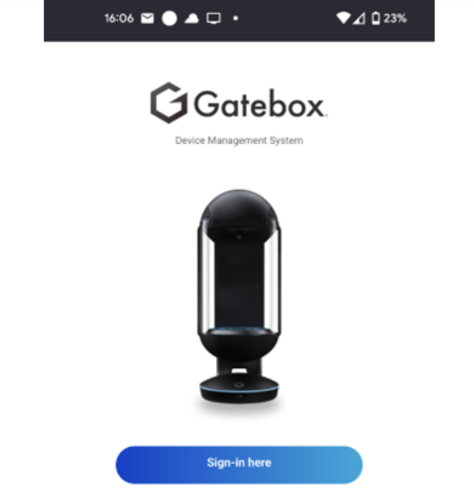

If you don’t have account yet, sign up from here.

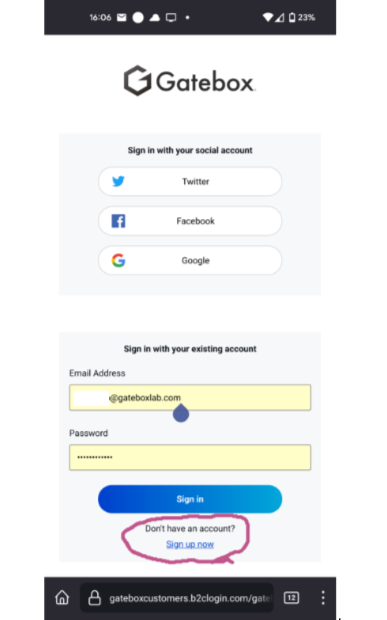

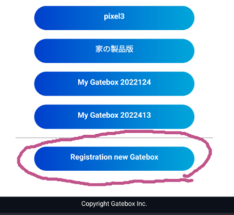

Input wifi ssid/password and push “Generate it” button

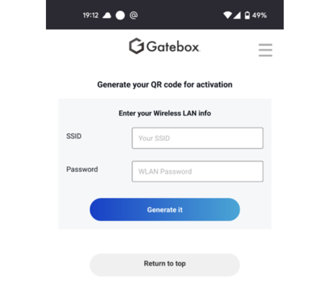

Then it shows QR code. You need to show it to Gatebox camera.

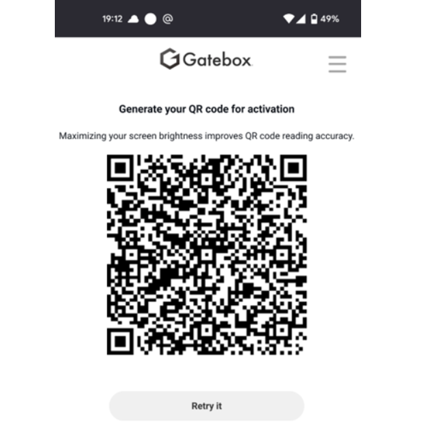

The initial setup is completed.

## Change Gatebox character

- e-VITA character are not available to normal account: to add e-VITA character, you need to contact the Gatebox Team and provide the e-mail address of your gatebox account. Then you will receive 3 e-VITA characters to your account.
- After that, you can select e-VITA character. Select the device, it registered previous section. In order to access e-VITA dashboard the user has to log in to the platform using the e-VITA Keycloak identity manager, using the login form shown in Figure.

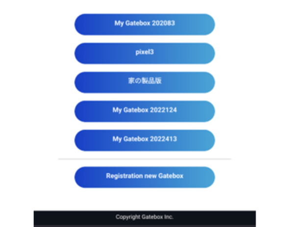

Select “Set application”.

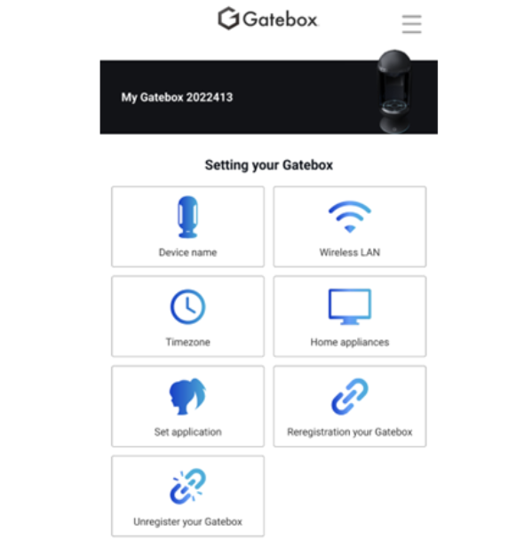

Select “EVITA_EU 1”, “EVITA_EU 2” or “EVITA_JP HIKARI”.

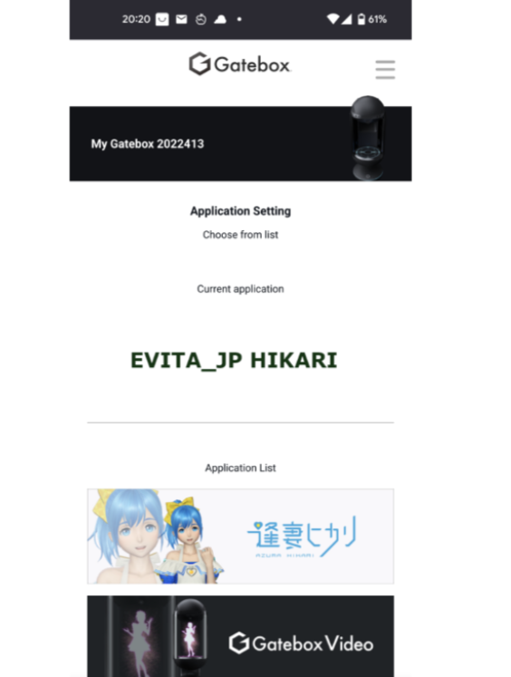

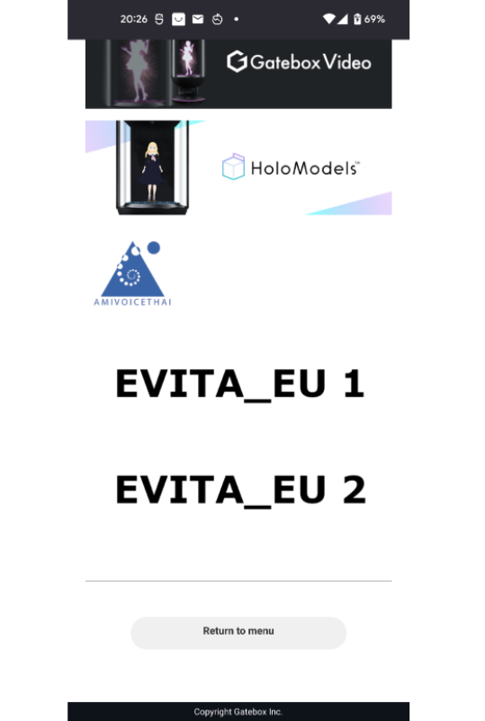

Then the character is automatically changed Gatebox. If not the character doesn’t change change automatically, try to push power button.

- _Show QR code to e-VITA app_: At the first launch of e-VITA app, you need to show the e-VITA QR-Code (the one that you find in the Gatebox detail page of the e-VITA platform) to Gatebox camera.

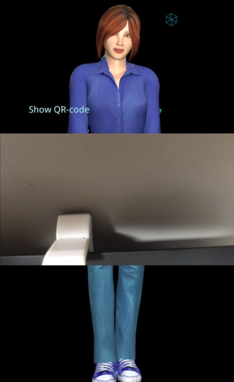

If the QR-Code is accepted, the camera window is automatically closed.

If you refresh token in e-VITA Platform or want to change the connected e-VITA Platform account, you need to show QR-Code again.  
When you need to show QR-Code again, push G button on Gatebox for 5 seconds, then the Camera window will show in screen.

## Use Gatebox with e-VITA Platform

To speak to the character, push G button once.

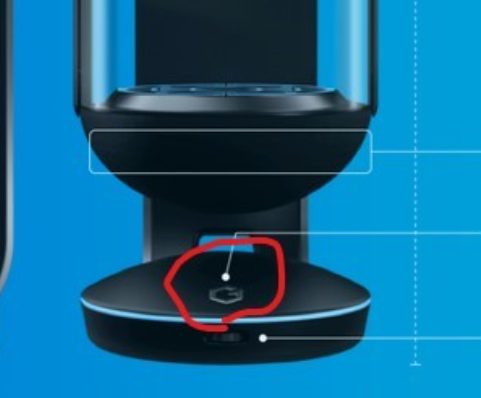

Character will say “Hi” and ear icon will show on screen, then you speak to character.  
If it’s acceptable, it will show what you said. And character will say something.
